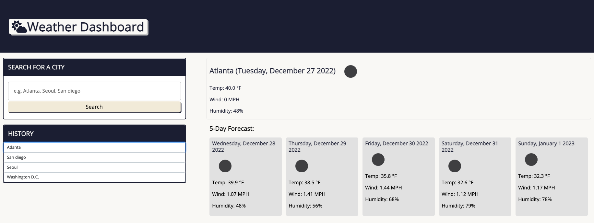

# Weather dashboard
## Description
This is a web application that allows users to search for a city and get the current weather and a 5-day forecast. Previous search history is saved in the user's local storage.
The web application is built using the OpenWeatherMap API and is designed to run in a browser. It features dynamically updated HTML and CSS and uses local storage to store persistent data. 
## Usage
To access the application, click the screenshot.

## Technology
- HTML
- JavaScript
- CSS Framework: Bootstrap
- Day.js
- API: OpenWeather
## Features
- Displays current and forecasted weather for a searched city
- When a user searches for a city, the city name is used to pull the current weather for that city
- The five-day forecast is populated using the geocording coordinates by location name returned from the current city weather API call
